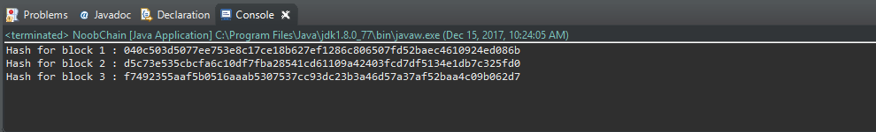
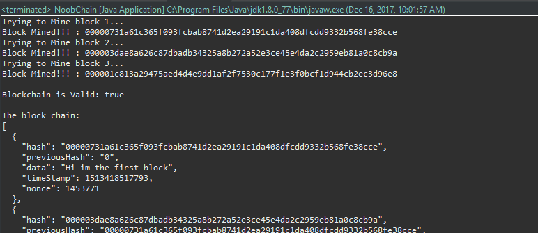

# 使用Java创造你的第一个区块链
Original address (English ver): https://medium.com/programmers-blockchain/create-simple-blockchain-java-tutorial-from-scratch-6eeed3cb03fa

*该repo用于学习与记录,主要为区块链相关博文翻译以及相应实践。想获取更多信息请点击以上原文链接。*

本教程系列的目的是帮助你了解开发区块链相关的技术。 

在本教程中，我们将获得以下的体验：
创建一个非常基本的区块链。
实现简单的工作量证明系统，也就是常说的挖矿。
为各种可能性感到惊叹!~

(本教程适用于已基本掌握面向对象编程知识的朋友)

需要注意的是，这将不会是一个功能完备适合生成的区块链产品。而是一种概念性的实现，从而帮助你理解未来教程中
的区块链。

这是《区块链开发巨型指南》的一部分。

## 配置

我们将使用Java,但是你可以使用任何面向对象的语言。我将使用Eclipse，但其实其他任何新潮的文本编辑器你都可以使用，尽管你会错过很多好的体验。

你将需要准备好以下几项：
+ JDK
+ Eclipse或者其他IDE/文本编辑器

你可以考虑添加Google的gson依赖，通过它可以将一个对象转为Json。这是一个超级好用的库，所以我们之后也会用这个去做一些P2P的东西。不过你要用其他方式的话也请便。

在Eclipse里，创建一个（file > new >）Java项目。我将会给我的项目命名"noobchain"然后也用这个名字去创建一个类（NoobChain）。

")

## 现在可以大展拳脚了

制作区块链
区块链只是一个包含块的链或者列表结构。 区块链中的每个区块将拥有自己的数字指纹，包含前一个区块的数字指纹，并具有一些数据（比如可以用于交易的数据）。

_")

## 哈希=数字指纹 (Hash = Digital Fingerprint)

每个区块不仅包含之前的哈希，他自己的一部分哈希也是从之前的哈希计算出来的。这样一来如果前面的哈希产生变化，进而会影响之后所有区块的哈希值(因为他有一部分哈希是基于之前的哈希值)。通过计算和比较哈希值，我们可以查看区块链是否无效。

这是什么意思呢？简单说就是更改了列表中的任何数据都将更改前面然后**中断这个链**。

## 所以我们先来创建一个用于组成区块链的区块类

    import java.util.Date;

    public class Block {

    	public String hash;
    	public String previousHash;
    	private String data; //our data will be a simple message.
    	private long timeStamp; //as number of milliseconds since 1/1/1970.

    	//Block Constructor.
    	public Block(String data,String previousHash ) {
    		this.data = data;
    		this.previousHash = previousHash;
    		this.timeStamp = new Date().getTime();
    	}
    }

如你所见，我们这个基础的Block类中包含一个名为hash的String变量，它保存我们的数字签名。previousHash则保存之前区块的哈希，然后data这个String变量则保存该区块的数据。

## 接下来我们将需要一个生成数字签名的方式

其实有很多加密算法你可以使用，但是SHA256对这个例子来说再合适不过。我们直接引用MessageDigest（import java.security.MessageDigest;）从而可以调用SHA256这个算法。

我们接下来需要使用SHA256，因此我们需要在新的StringUtil类中创建一个helper方法（applySha256）。

    import java.security.MessageDigest;

    public class StringUtil {
	    //Applies Sha256 to a string and returns the result. 
    	public static String applySha256(String input){		
	    	try {
		    	MessageDigest digest = MessageDigest.getInstance("SHA-256");	        
			    //Applies sha256 to our input, 
    			byte[] hash = digest.digest(input.getBytes("UTF-8"));	        
	    		StringBuffer hexString = new StringBuffer(); // This will contain hash as hexidecimal
		    	for (int i = 0; i < hash.length; i++) {
			    	String hex = Integer.toHexString(0xff & hash[i]);
				    if(hex.length() == 1) hexString.append('0');
				    hexString.append(hex);
    			}
	    		return hexString.toString();
	    	}
    		catch(Exception e) {
    			throw new RuntimeException(e);
    		}
    	}	
    }

如果你不是很理解这个helper方法中的内容，不用过于担心，所有你需要明白的只是这个会接收一个字符串变量然后对其应用SHA256算法。最后返回由这个字符串生成的字符串签名。

现在让我们在Block类的新方法中使用applySha256 helper方法来计算哈希值。我们必须从那些不希望被修改的块中计算哈希值。所以我们的块中需要包含previousHash、data和timeStamp这些变量。

    public String calculateHash() {
	    String calculatedhash = StringUtil.applySha256( 
		    	previousHash +
			    Long.toString(timeStamp) +
			    data 
			    );
	    return calculatedhash;
    }

然后把这个方法加到Block的构造器里…

## 测试时间到…

在NoobChain主类中，让我们创建一些块并将哈希值打印到屏幕上，以查看一切是否都在正常工作。

第一个块称为创世块，由于没有先前的块，我们只需输入“ 0”作为先前的哈希即可。

    public class NoobChain {

	    public static void main(String[] args) {
            
		    Block genesisBlock = new Block("Hi im the first block", "0");
		    System.out.println("Hash for block 1 : " + genesisBlock.hash);
    
	    	Block secondBlock = new Block("Yo im the second block",genesisBlock.hash);
		    System.out.println("Hash for block 2 : " + secondBlock.hash);
    
	    	Block thirdBlock = new Block("Hey im the third block",secondBlock.hash);
		    System.out.println("Hash for block 3 : " + thirdBlock.hash);
		
	    }
    }

输出的结果应该很像下图：

 

现在所有的区块都有基于自身信息以及之前区块签名的数字签名了。

当前他还不是一个很大的区块链，所以让我们将这些区块都存到ArrayList里然后导入Gson依赖以Json形式来查看他。

    import java.util.ArrayList;
    import com.google.gson.GsonBuilder;

    public class NoobChain {
	
    	public static ArrayList<Block> blockchain = new ArrayList<Block>(); 

    	public static void main(String[] args) {	
    		//add our blocks to the blockchain ArrayList:
    		blockchain.add(new Block("Hi im the first block", "0"));		
    		blockchain.add(new Block("Yo im the second block",blockchain.get(blockchain.size()-1).hash)); 
    		blockchain.add(new Block("Hey im the third block",blockchain.get(blockchain.size()-1).hash));
		
    		String blockchainJson = new GsonBuilder().setPrettyPrinting().create().toJson(blockchain);		
    		System.out.println(blockchainJson);
    	}

    }

现在我们的输出应该看起来和我们期望的区块链很接近了。

## 现在我们需要一种检查区块链完整性的方法

我们来创建一个isChainValid()返回值是Boolean类型的方法，它将遍历链中所有区块并比较他们的哈希值。这个方法将确认Hash变量实际上等于计算出的哈希，并且之前区块的哈希等于previousHash变量。

	public static Boolean isChainValid() {
		Block currentBlock; 
		Block previousBlock;
	
		//loop through blockchain to check hashes:
		for(int i=1; i < blockchain.size(); i++) {
			currentBlock = blockchain.get(i);
			previousBlock = blockchain.get(i-1);
			//compare registered hash and calculated hash:
			if(!currentBlock.hash.equals(currentBlock.calculateHash()) ){
				System.out.println("Current Hashes not equal");			
				return false;
			}
			//compare previous hash and registered previous hash
			if(!previousBlock.hash.equals(currentBlock.previousHash) ) {
				System.out.println("Previous Hashes not equal");
				return false;
			}
		}
		return true;
	}

任意一个对区块链中区块的的改动都将使这个方法返回false。

在比特币网络上，节点们共享他们的区块链和最长有效链是被网络所允许的。那有什么办法可以阻止某个人篡改旧数据块，并且创建一个更长的全新区块链并将其呈现给整个网络？答案是**工作证明**。有hashcash这种工作证明机制意味着需要大量时间和算力才能创建新的区块。所以攻击者需要超过其余所有人算力的总和才能实现这件事。

## 来整一个挖矿区块

我们将要求我们的"矿工"尝试不同的变量值进行工作量证明，直到其哈希值是以0开头的一个具体数字。

让我们在calculateHash()这个方法中加入一个叫nonce的int值，然后还有我们急需的mineBlock()方法。

	import java.util.Date;

	public class Block {
	
		public String hash;
		public String previousHash; 
		private String data; //our data will be a simple message.
		private long timeStamp; //as number of milliseconds since 1/1/1970.
		private int nonce;
	
		//Block Constructor.  
		public Block(String data,String previousHash ) {
			this.data = data;
			this.previousHash = previousHash;
			this.timeStamp = new Date().getTime();
		
			this.hash = calculateHash(); //Making sure we do this after we set the other values.
		}
	
		//Calculate new hash based on blocks contents
		public String calculateHash() {
			String calculatedhash = StringUtil.applySha256( 
					previousHash +
					Long.toString(timeStamp) +
					Integer.toString(nonce) + 
					data 
					);
			return calculatedhash;
		}
	
		public void mineBlock(int difficulty) {
			//Create a string with difficulty * "0" 
			String target = new String(new char[difficulty]).replace('\0', '0'); 
			while(!hash.substring( 0, difficulty).equals(target)) {
				nonce ++;
				hash = calculateHash();
			}
			System.out.println("Block Mined!!! : " + hash);
		}
	}

这个mineBlock方法接收一个叫做difficulty的int值，这是他们必须要解决的“0数”（the number of 0's）。低难度比如1或2是可以在大部分计算机上被迅速解决的，所以我建议用4-6这样的难度用于测试。另外一提，在撰写本文时（17年12月）莱特币的difficulty大概是442,592。

我们将difficulty作为静态变量添加到NoobChain类当中：

	public static int difficulty = 5;

我们应该更新NoobChain类去为每一个区块触发这个minedBlock()方法。isChainValid()还应该检查是否每个区块具有已解决的哈希。

	import java.util.ArrayList;
	import com.google.gson.GsonBuilder;

	public class NoobChain {
	
		public static ArrayList<Block> blockchain = new ArrayList<Block>();
		public static int difficulty = 5;

		public static void main(String[] args) {	
			//add our blocks to the blockchain ArrayList:
		
			blockchain.add(new Block("Hi im the first block", "0"));
			System.out.println("Trying to Mine block 1... ");
			blockchain.get(0).mineBlock(difficulty);
		
			blockchain.add(new Block("Yo im the second block",blockchain.get(blockchain.size()-1).hash));
			System.out.println("Trying to Mine block 2... ");
			blockchain.get(1).mineBlock(difficulty);
		
			blockchain.add(new Block("Hey im the third block",blockchain.get(blockchain.size()-1).hash));
			System.out.println("Trying to Mine block 3... ");
			blockchain.get(2).mineBlock(difficulty);	
		
			System.out.println("\nBlockchain is Valid: " + isChainValid());
		
			String blockchainJson = new GsonBuilder().setPrettyPrinting().create().toJson(blockchain);
			System.out.println("\nThe block chain: ");
			System.out.println(blockchainJson);
		}
	
		public static Boolean isChainValid() {
			Block currentBlock; 
			Block previousBlock;
			String hashTarget = new String(new char[difficulty]).replace('\0', '0');
		
			//loop through blockchain to check hashes:
			for(int i=1; i < blockchain.size(); i++) {
				currentBlock = blockchain.get(i);
				previousBlock = blockchain.get(i-1);
				//compare registered hash and calculated hash:
				if(!currentBlock.hash.equals(currentBlock.calculateHash()) ){
					System.out.println("Current Hashes not equal");			
					return false;
				}
				//compare previous hash and registered previous hash
				if(!previousBlock.hash.equals(currentBlock.previousHash) ) {
					System.out.println("Previous Hashes not equal");
					return false;
				}
				//check if hash is solved
				if(!currentBlock.hash.substring( 0, difficulty).equals(hashTarget)) {
					System.out.println("This block hasn't been mined");
					return false;
				}
			}
			return true;
		}
	}

运行后的结果应该大概是这样的：

挖掘每一个区块都需要一个时间(大概3秒)！你应该弄乱难度，以了解如何影响挖掘每个块所需的时间。

如果有人想篡改你这个区块链系统里的数据😒：

+ 他们的区块链将无效。
+ 他们将无法创建更长的区块链。
+ 你网络中最诚实的区块链将在最长的链上具有优势。

被篡改的区块链将不可能追上更长并且有效的链。除非它们的计算速度比网络中所有其他节点的总和大得多。
未来的量子计算机之类的东西。

## 基本的区块链已经完成了！

你已经实现了这样一个区块链：
* 由储存数据的块组成。
* 具有把块连在一起的数字签名。
* 有挖矿工作量证明机制用以验证新块。
* 可以检查其中的数据是否有效或者不变。

